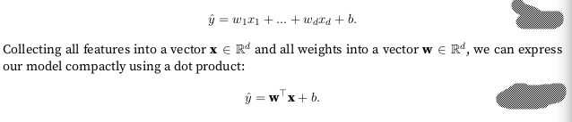
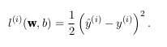
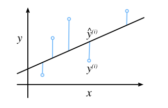
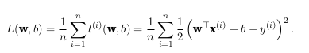

  <h1>LINEAR REGRESSION</h1>

  Regression refer to a set of methods for modeling relationship between one or more independent variables and a dependent variable. Machine learning is most often concerned with prediction.

  The regression model assume that the relationship between the independent variables x and the dependent variable y can be expressed as a weighted sum of elements x, plus some noise.

  In the machine learning jargon the data-set is called the training data-set, each row is called an example, and the thing that it's trying to predict, is called label or target.

  Machine learning normally is working with large data-set it's then that is more convenient to work with linear algebra notation. the inputs consist of d features and the prediction is denoted with a y hat, as is showed in the picture  

  

<h2>Loss Function</h2>

The loss function quantifies the distance between **real** and **predicted** value of the target. The loss function will be usually a non-negative number where smaller values are better, and perfect prediction will occur in a loss of 0.

One simple way to define one loss function is with the square error, which is defined as a follow.

The following picture represent one linear model in one dimension, the y hat is the real value, and the y is the predicted value.

Large differences between estimates ŷi and yi
lead to even larger contributions to the loss, due to the quadratic dependence.

To measure the quality of a model, one common function is just the average of the differences, its mean we don't use the half error square but the average error square.

When we training a model we wanna find parameters (w,b) that minimize the total loss across the training examples.

<h2>Minibatch Stochastic Gradient descent</h2>

The way of finding the parameters w and b that minimizing the loss function is derivate the loss function and find the minimum, for finding the minimum is needed evaluating each example of the dataset in the derivate's loss function, this is no always possible because in M.L we are working with million of data, so the alternative way is applying the method as stochastic gradient which state the follow

  

The above equation basically states that the current parameters that minimizing the function is the previous value of parameters less the derivate of the loss function regard to the model parameters and multiplied by the learning rate over the len of batch that in this case is a minibatch.

How we need the previous values of w,b for performing the firs step is needed initializing the w and b with some values, in some cases with zeros or follow some techniques

For example in the case that our loss function would be squared loss the SGD would looks like the following:

 The parameters η and β, must be chosen manually and aren't updatable on each iteration, this parameters are known as hyperparameters, and this ones are tweaked depend on the result of assess of the effectiveness of the training model.
