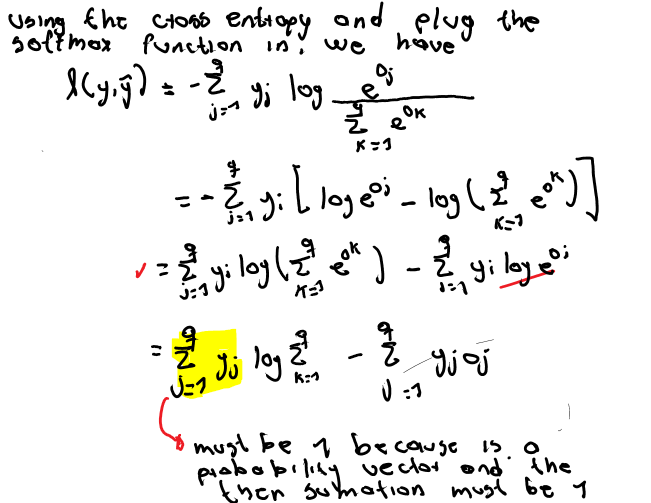

# Softmax Regression

## Classification Problem

In classification image problems, each pixel feature may be represented as x1, x2, x3, and x4. Their labels may be stored with numbers, but if these values are not ordered, it's much better to rely on one-hot encoding. I.e. we create vectors with binary values for each label. For instance, let's say we have 3 pictures: a cat, a chicken, and a dog. We can store these as follows:

-(1, 0,0) cat
-(0, 1, 0) chicken
-(0, 0, 1) dog

## Network Architecture

We need as many affine functions as we have outputs. In this example we have 3 outputs, cat, chicken, and dog. How do we compute the amount of scalars for the functions? Well, we already have 3 outputs and 4 features. Let us write a function for one of these outputs

*o1 = x1w1 + x2w1 + x3w1 + x4w1 + b*

Per feature, we'll have a weight and all of this will be plus a bias. Therefore, if we have 4 features and 3 outputs, we'd need **12 scalars** (4 x 3). This new arrangement would yield the following equations.

o1 = x1w11 + x2w12 + x3w13 + x4w14 + b

o2 = x1w21 + x2w22 + x3w23 + x4w24 + b

o3 = x1w31 + x2w32 + x3w33 + x4w34 + b

In vector form all of this can be represented as follows:

**o = Wx + b** where lowercase is for vectors and uppercase bold is used for matrices.

Softmax regression, like linear regression, is also a single-layer nn. Since the computation of the output is bound to all inputs, its output layer is a **fully-connected layer**.

The cost of the a fully-connected layer will then be features x outputs. This madness can be reduced if we divide this by a hyperparameter

## Softmax Operation

These outputs, *o*, are logits. We should, of course, convert them to probabilities. The softmax function enables this. Each logit is exponentiated (e^o) and then divide by their sum. Thereafter, we can have an argmax, which will yield the index of the highest value (i.e. the probability).

Although softmax is a nonlinear function, the outputs of softmax regression are still determined by an affine transformation of input features; thus, softmax regression is a linear model.

## Vectorization for Minibatches

We are given a minibatch of **X** this turns the matrix-vector multiplication into a matrix-matrix multiplication **XW**. Then we can rely on broadcasting to operate with the vector **b**.

**O = XW + b**

**Y-hat** = softmax(**O**)

## Loss function

The loss function gives a measure to estimate the quality of our predicted probabilities. The maximum likehood estimator give us the information about which parameters are the apropiate to aproaching to the correct values of our predicted values

### Log-Likelihood, softmax, and derivatives

The maximum likelihood estimation's minimization equivalent is the negative log-likelihood. The loss function *l* is the *cross-entropy loss*:

### Cross-Entropy Loss

The one-hot encoding is translated to probabilities. Cross-Entropy Loss is the expected value of the loss for a
distribution over labels.

## Information Theory Basics

- Entropy: Minimum amount of nats to encode data from the P distribution.
	- nat: 1/log(2) --> aprox 1.44 bit
	- If you wonder what a “nat” is, it is the equivalent of bit but when using a code with base e rather than one with base 2
	- This amount of nats to encode it is represented as H[P]
- Surprisal: When we have subsequent tokens for compression that we cannot predict, i.e. they *surprise* us
	- Our surprise is greater when we assigned an event lower probability.
	- When an event holds a low probability is given, its surprisal is high.
In short, we can think of the cross-entropy classification objective in two ways: (i) as maximizing
the likelihood of the observed data; and (ii) as minimizing our surprisal (and thus the number of
bits) required to communicate the labels.
